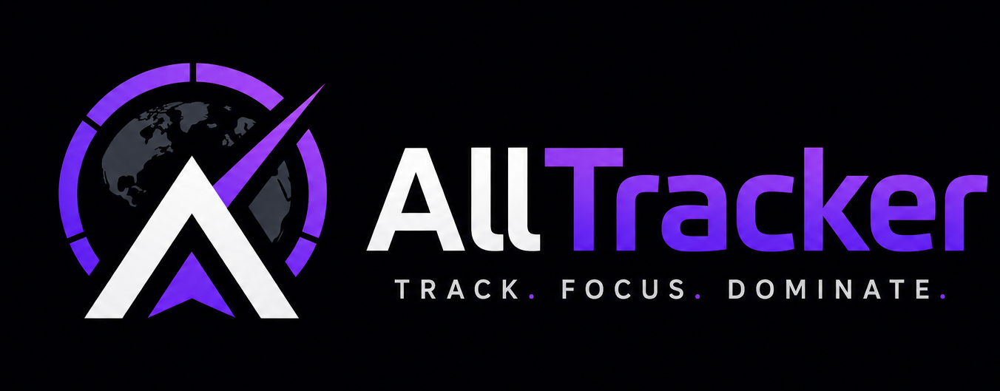

<div align="center">
  
  <h1> All Tracker</h1>
  <p><strong>The High-Performance Mission Control for Focused Development & Study.</strong></p>

  <p>
    <a href="https://alltracker.online"><strong>Live Tracker</strong></a> |
    <a href="https://github.com/ankitpandey1900/Tracker/issues">Report Issue</a> |
    <a href="https://github.com/ankitpandey1900/Tracker/pulls">Contribute</a>
  </p>
</div>

---

## 🚀 The Vision
All Tracker is a revolutionary, gamified productivity command center. Designed for those who "grind" in silent hours, it transforms habit tracking into a high-stakes **World Stage**. With a high-fidelity "Neon Space" aesthetic and deep-focus analytics, it’s built to keep you obsessed with your own progress.

---

## 🔥 Core Features

### 🪪 Universal OAuth Identity
Professional, secure registration via **Google** or **GitHub**. No more manual passwords or complex recovery keys—your mission history is anchored to your professional identity.

### 🛡️ Secure Sync ID Logic
Identity locking ensures your **Handle** and **Real Name** are permanent, maintaining the integrity of the World Stage Global Rankings.

### 🤖 Maamu AI Strategist
A data-aware AI mentor who analyzes your mission history to provide tactical coaching. Includes a **Beast Mode** toggle for high-intensity motivation.

### ⚡ Performance Architecture
- **API-Driven Vaulting**: All data is secured via a Vercel-hosted backend. No direct database exposure on the client.
- **Local-First Speed**: Instant UI hydration from `localStorage`, with the **Data Bridge** orchestrating seamless background cloud synchronization.
- **Monolithic Vanilla TS**: Built from scratch with pure TypeScript for zero-overhead, sub-millisecond interaction latency.

---

## 🛠️ Technical Stack
- **Frontend**: [Vite](https://vitejs.dev/) + [TypeScript](https://www.typescriptlang.org/)
- **Authentication**: [Better Auth](https://better-auth.com/) (OAuth2)
- **Backend**: [Vercel API Routes](https://vercel.com/) (Node.js)
- **Database**: [Supabase](https://supabase.com/) (PostgreSQL)
- **Styling**: Vanilla CSS (Semantic Design Tokens)

---

## ✈️ Getting Started

### Prerequisites
- Node.js (v18+)
- A Supabase Project (PostgreSQL)

### Installation
1. **Clone & Enter**
   ```bash
   git clone https://github.com/ankitpandey1900/AllTracker.git
   cd ALLTracker
   ```

2. **Setup Environment**
   ```bash
   cp .env.example .env
   # Add your DATABASE_URL, BETTER_AUTH_SECRET, and OAuth Credentials
   ```

3. **Install & Launch**
   ```bash
   npm install
   npm run dev
   ```

---

## 📜 Repository Guidelines

Detailed internal blueprints can be found in the [**/docs**](./docs) folder:
- **[Pilot Manual](./docs/guide.md)**: Identity setup and core mechanics.
- **[Development Blueprint](./docs/development.md)**: Logic, Engine, and Security SOPs.
- **[Structural Map](./docs/structure.md)**: Repo hierarchy and structural logic.

---

## 🏆 Hall of Fame
Each pilot has a detailed record in the Arena.
- **[Lead Architect: Ankit Pandey](./arena-pilots/ankit-pandey.md)**
- **[Full Stack Developer: Saumya Jha](./arena-pilots/saumya-jha.md)**

---

<p align="center"><strong>Victory is earned in the silence of deep work.</strong> 🛸🔥</p>
